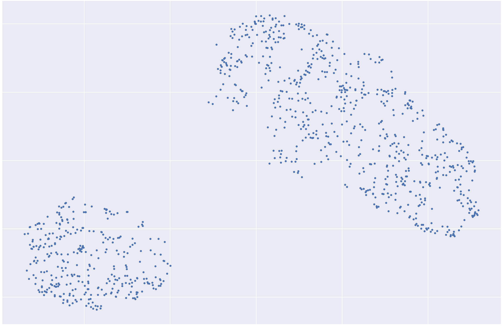
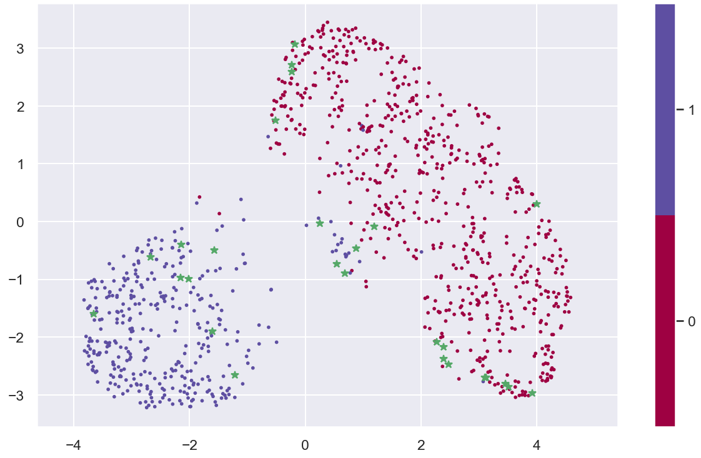
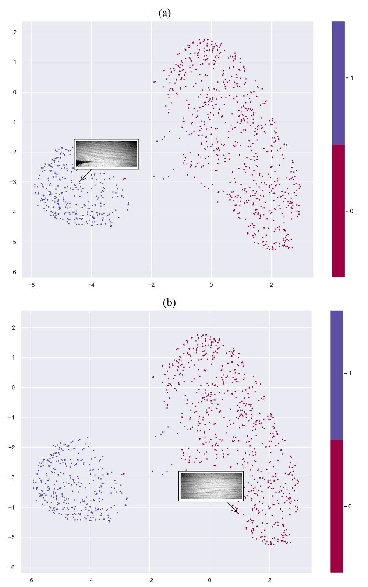

# Rapid-Hybrid-Learning-for-Visual-Inspection (RHL)
# 1- Introduction
Most of the natural material inspection systems suffer by frequently changes in visual appearance between batches of production. Moreover, there are some visual sorting problems that collecting and labeling numerous training samples require destructive tests. Thous problems are including wood strength estimation, metal ductility fracture prediction, prediction of structural failure (e.g. prediction of wind turbine emergency stop) and etc. Hence, training with a huge amount of labeled samples is not feasible from time and cost efficiency point of view. 

The appearance variations of natural materials such as building stone tiles, wooden boards, and medical samples against the original training materials tend to decrease the classification performance. Repeatedly collecting and labeling complete representative sample sets is a tedious effort that usually limits the accuracy and consequently the efficiency of the visual inspection system. 

Since labeling any training samples is an error-prone process and limits the performance of both supervised and semi-supervised learning schemes, categorizing training samples should be done after training feature representation phase. Therefore, the objective of devising RHL is category representation and dimension reduction in an unsupervised manner and diminishing the number of samples that need human judgment in a supervised training phase.

This post is an explanation of the developed RHL which has been successfully applied in different visual inspection problems like pencil slat and medical fundus images classification. Detailed description and results can be found in the original paper (Rapid Hybrid Learning for Visual Inspection, the link will provide soon). Also, the pencil slat data set which consist of 10 000 ground truth labeled samples is available in this post. 

# 2- How the RHL performs
We implemented the RHL in two major phase. First; an off-line unsupervised approach to build a powerful representation and dimension reduction tool. Second; an on-line supervised classifier training approach by employing active learning with uncertainty sampling. The proposed approach enables classifier to learn the category distribution space incrementally with new critical samples (which are close to the category boundaries), while it is performing the classification process on stream of data.

The developed algorithm of RHL consist of below steps.

   * Loading and normalizing data
   * Representation learning using Convolutional Auto-Encoder (CAE)
   * Demonstration and evaluation of representation learning using human vision and UMAP
   * Initial training of the random forest classifier
   * Uncertainty sampling, and classifying samples (with no uncertainty in category) in data stream 
   * Performance evaluation 

We will discuss each step of RHL and present Python cods in detail in later sections

# 2.1- Load and normalize data
 Some required packages will import using below cods;
 
    from keras.models import Model
    import matplotlib.pyplot as plt 
    import numpy as np
    from keras.utils import plot_model
    import keras
    from keras import layers
    import cv2
    from keras import optimizers, losses
    from sklearn.metrics import f1_score
    from sklearn.metrics import confusion_matrix
    from sklearn import metrics
    from copy import deepcopy
    from sklearn.ensemble import RandomForestClassifier
    from sklearn.metrics import confusion_matrix,classification_report
    import seaborn as sns; sns.set()                        
    from keras.utils import np_utils
    import umap
    from matplotlib.offsetbox import OffsetImage, AnnotationBbox
    get_ipython().run_line_magic('matplotlib', 'qt')
    from matplotlib.offsetbox import OffsetImage, AnnotationBbox
    %matplotlib inline

Based on industrial operation problem, we split whole 10 000 pencil slat samples to four separate data sets. Those are include (each one will describe later in relevant section) 

   * Less than 1000 unlabeled samples that selected among the majority class of data, Xu.
   * 1000 labeled samples Xt 
   * Small initial training set xl include 50 labeled samples. Two samples per each category will select in a random manner to establish the categories for classifier.  
   * 8 000 labeled instances as a stream of samples Xs for uncertainty sampling / classification, and final evaluations.

Each set of data is selected in a random manner and all are independent to each other. Below codes are used for importing data sets, extracting the red channel of images, normalizing, and preparing the shape of samples for convoutional auto-encoder.

Import data sets.

Below function converts original images to one-channel of normalized and reshaped images separatly for each one of dataset;

    def convert_images(images, num_images, output_shape):
    
        #This function converts original images to one-channel normalized and reshaped images
    
        converted_images = []
        for i in range(num_images):
            image = images[i]
            image = image.astype(np.float32)
            image = image[:,:,0]              # Red channel extraction
            image = cv2.normalize(image, None, 0, 1, norm_type=cv2.NORM_MINMAX,dtype=cv2.CV_32F)
            converted_images.append(image)
        converted_images = np.array(converted_images)
        plt.figure()
        plt.imshow(converted_images[0])
        #plt.title("One sample of ")
        plt.gray()
        plt.grid()
        plt.show()
        converted_images = np.reshape(converted_images, (num_images, output_shape[0], output_shape[1], output_shape[2]))
        return converted_images
    
# 2.2- Representation learning
The main objective of the RHL is diminishing human involvements in training a visual inspection systems. Therefore, a convolutional auto-encoder has been used to learn data representation in an unsupervised manner.

In this step, the goal is learning data features and reconstructing the original inputs from the features, Then utilizing the encoder part of convolutional auto-encoder as a feature extractor to represent the data features in a low dimensional space. 

This step of the algorithm is an unsupervised process, therefore we provided an unlabeled set of training samples (Xu) that consist of 1000 samples which were selected from the majority class of data (both balanced and highly imbalanced data sets have been used in representation learning phase to analysis the penalty rate, Please see the original paper). Note that, based on the experiments, less than 1000 highly imbalanced training samples is enough for an efficient data representation and acceptable final accuracy, although it cause a minor penalty on the final accuracy.  

In this phase, a feature extractor has been developed using the encoder part of convolutional auto-encoder. The feature extractor unit utilizes in both off-line (for evaluation of representation learning using Xt) and on-line (for supervised learning and final evaluation) phases. 

Below code shows the structure, parameters, optimiser and loss function of the employed convolutional auto-encoder;

    def create_autoencoder_model():
        """
        This function creates convolutional autoencoder model
        """
        Input = layers.Input(shape=(48,112,1))
        conv1 = layers.Conv2D(8, 3 , activation='relu', padding='same', strides=2)(Input)
        conv2 = layers.Conv2D(4, 3 , activation='relu', padding='same', strides=1)(conv1)
        encode = layers.MaxPool2D(pool_size=2)(conv2)
        up1 = layers.UpSampling2D((2,2))(encode)
        deconv1 = layers.Conv2D(4, 3 , activation='relu', padding='same', strides=1)(up1)
        up2 = layers.UpSampling2D((2,2))(deconv1)
        deconv2 = layers.Conv2D(8, 3 , activation='relu', padding='same', strides=1)(up2)
        deconv3 = layers.Conv2D(1, 3 , activation='sigmoid', padding='same', strides=1)(deconv2)
        encoder = Model(Input, encode)
        autoencoder = Model(Input, deconv3)
        return encoder, autoencoder
        
    # Prepairing datasets using convert_images function;
    Xu = convert_images(Xu_C0, 1000, (48,112,1))
    Xt = convert_images(Xt_labeled, 1000, (48,112,1))
    xl = convert_images(xl_labeled, 50, (48,112,1))
    Xs = convert_images(Xs_labeled, 8000, (48,112,1))

    encoder, autoencoder = create_autoencoder_model()
    autoencoder.compile(keras.optimizers.Adam(), loss=keras.losses.MSE, metrics=[ "accuracy","categorical_accuracy"])

    # Training the network
    autoencoder.fit(Xu, Xu, batch_size=20,epochs=450, validation_split=0.1) 
    
# 2.2.1- Demonstration and evaluation of power of representation learning
The labeled data set Xt is provided to evaluate reconstruction performance of the convolutional auto-encoder and its category discrimination power.

For reconstruction evaluation through human point of view, below codes select some samples of Xt and feed them to the trained convolutional auto-encder and show the outputs. Figure 1 shows some original and reconstructed images. 

    # Image reconstruction using trained convolutional auto-encoder for 
    # representation learning evaluation with human point of view

    Reconstructs = autoencoder.predict(Xt)   #Images reconstruction

    for i in range (1):
        ind = np.random.choice(500)
        #ind = 19   #some defected samples
        #ind = 640
        ind = 777    
        imag1 = Xt_labeled[ind]
        imag1 = np.reshape(imag1,(48,112,3))
        plt.figure()
        plt.title("Original image")
        plt.imshow(imag1)
        plt.gray()
        plt.grid()
        plt.show()
    
        image = Reconstructs[ind]
        image = np.reshape(image,(48,112,1))
        plt.figure()
        plt.imshow(image[:,:,0])
        plt.title("Reconstructed image")
        plt.gray()
        plt.grid()
        plt.show()
        

FIGURE 1; Original images and respective reconstructed samples using Convolutional auto-encoder

The classifier training phase and final accuracy are highly relying to the extracted features. So, validation of the discriminant power of the convolutional auto-encoder is very important.

To evaluate the discrimination power of the representation learning built with imbalanced data, bellow code employs [UMAP](https://github.com/lmcinnes/umap) and Figure 2 shows UMAP output of set Xt. Note that, in case of a weak representation learning, different categories are merged together and it is not possible to conclude a discriminating boundary from represented categories. 

    n_class = [0,1]

    x_test_umap  = encoder.predict(Xt)         # Employing encoder to extract features of Xt
    x_test_umap  = np.reshape(x_test_umap ,(np.shape(x_test_umap )[0],12*28*4))

    reducer = umap.UMAP(random_state=42,n_neighbors=35) # UMAP initialization
    reducer.fit(x_test_umap)
    embedding_test = reducer.transform(x_test_umap)     # Data representation with UMAP
    
    plt.figure() # Visualizing UMAP outputs
    plt.figure(figsize=(8,6))
    plt.plot(embedding_test[:,0], embedding_test[:, 1], 'b.')
    plt.title('UMAP projection of dataset Xt', fontsize=16)
    plt.show() 
    

FIGURE 2; UMAP category representation (a 2D visualization of represented data)

# 2.3- On-line supervised training with uncertainty sampling

A rapid training process with less possible human efforts requires an uncertainty sampling method that focuses on discriminating samples (category boundaries) and selects the most uncertain samples for human judgments. 

The uncertainty sampling step of current scheme is based on Query-By-Committee (QBC) principle, and we employed random forest as a committee of classifiers. Each tree in the random forest is a committee member and their outputs are used to estimate the Certainty Ratio

CR > p,

where $p$ is a certainty threshold value that is set by human operator (e,g 0.58). If the votes (CR) for category of a sample fall below the $p$ value, the class of the respective sample would asked from the operator.

The on-line phase of the RHL algorithm consist of below steps:

* Feature extraction of sets Xs and xl

      x_train_commit = encoder.predict(xl) # Employing encoder to extract featurs of Xl
      x_train_commit = np.reshape(x_train_commit,(np.shape(x_train_commit)[0],12*28*4))
      y_train_commit = yl

      x_pool_test = encoder.predict(Xt)  # Employing encoder to extract featurs of Xt
      x_pool_test = np.reshape(x_pool_test,(np.shape(x_pool_test)[0],12*28*4))
      y_pool_test = yt

      X_stream = encoder.predict(Xs)      # Employing encoder to extract featurs of Xs
      X_stream = np.reshape(X_stream,(np.shape(X_stream)[0],12*28*4))
      y_stream = ys

      xu_CRF2 = Xs # Producing a copy of original Xs for later usage

      X_for_display = np.reshape(Xs, (8000,48,112)) # Reshaping Xs samples to display on monitor for operator

* Setting up the initial parameters 
      
      n_class = [0,1]
      n_initialsample = 2 # Algorithm will select 2 sample per class in a random manner   
      n_query = 24

      Xq = []
      yq = []
      queried_idxlist = []
      initial_index = 0
    
* Initial training of random forest using xl
* Uncertainty sampling step;
     Categorizing samples of Xs, or
     If certainty threshold is not reached, ask category from the operator and add the labeled sample to set Xq.              * Retraining the random forest classifier with set Xq.
     
Note that below code will display some previously queried samples by human operator. This enables the operator to have a glimpse on earlier samples and decide about new uncertain sample, or even change previous classifications if necessary. 

    while n_query >= 0:
        
        if initial_index == 0:
            # Initial training data selection in a random manner
            train_idx = []
            for K in range ((np.shape(n_class)[0])):
                i = 0
                while i < (n_initialsample/(np.shape(n_class)[0])):
                     x = np.random.choice(range(x_train_commit.shape[0]))
                     xy = y_train_commit[x]
                     if xy == K:
                     train_idx.append(x)
                         i = i + 1
            
            train_idx = np.array(train_idx) # Set some indexes to select random samples from Xl
            train_idx1 = np.reshape(train_idx, (n_initialsample,1))
            train_idx = []
            for i in range(np.shape(train_idx1)[0]):  # Shuffling the list of training samples
                z = np.random.choice(range(np.shape(train_idx1)[0]))
                train_idx = np.append(train_idx, train_idx1[z])
                train_idx1 = np.delete(train_idx1, z, axis = 0)
            train_idx = train_idx.astype(np.int32)
        
            # Sellection of initial training samples
            x_train_initial = x_train_commit[train_idx]  
            # Label selection of initial training samples
            y_train_initial = y_train_commit[train_idx]  
        
            # Removing selected (known) samples amonge Xl
            x_train_commit = np.delete(x_train_commit, train_idx, axis = 0)
            y_train_commit = np.delete(y_train_commit, train_idx, axis = 0)
                    
        RF_model = RandomForestClassifier(n_estimators = 500)     # Initializing the random forest
        Models = RF_model.fit(x_train_initial, y_train_initial)   # Training the model
        
        y_rf_pred = RF_model.predict(x_pool_test)   # Label prediction of xt samples
        print ("\nThe confusion matrix after retraining\n")
        print (metrics.classification_report(y_pool_test, y_rf_pred )) # Demonstrating the confusion matrix 

        # Unlabeled sample selection from stream of data (Xs)
        unlabeled_idx = np.random.choice(range(X_stream.shape[0]), size= 1, replace=True)
        x_unlable = X_stream[unlabeled_idx]
    
        # Removing selected (known) samples from list X_stream
        X_stream = np.delete(X_stream,unlabeled_idx, axis= 0)
        y_stream = np.delete(y_stream,unlabeled_idx)

        x_u_predicted = Models.predict_proba(x_unlable) # Voting for category of selected sample
          
        CR = np.max(x_u_predicted)  # Certainty Ratio estimation

        P_index = 60 # Defining the certainty threshold  (P) (below 60 is fine)

        if (CR*100) >  P_index:
           print ("The sample with index", unlabeled_idx, "has no uncertainty in category")

        else: # Query the label of uncertain sample with operator
           if (np.shape(yq)[0] > 1):
               # A presentation of earliar queried samples
               queried_samp = np.array(Xq)
       
               yq_0 = np.where(yq<1)
               yq_1 = np.where(yq>0)
       
               Xq_0 = queried_samp[yq_0]
               Xq_1 = queried_samp[yq_1]

               ind = np.shape(yq_0)[1]
               if ind < 13: 
                   print("  \t\t\t\t\t\t Queried samples, Calss 0   ")
                   plt.figure(figsize=(12,4))

                   for i in range(ind):
                       plt.subplot(1,ind,i+1)
                       plt.imshow(Xq_0[i])
                       plt.grid(None)
                   plt.show()
       
                   print("\n\n \t\t\t\t\t\t Queried samples, Calss 1   ")
                   plt.figure(figsize=(12,4))
                   ind = np.shape(yq_1)[1] 
                  for i in range(ind):
                       plt.subplot(1,ind,i+1)
                       plt.imshow(Xq_1[i])
                       plt.grid(None)
                   plt.show() 
           
           # Demonstrating selected uncertain sample
           x_for_plot = xu_CRF2
           x_for_plot = x_for_plot[unlabeled_idx][:,:,:,0]
           x_for_plot = np.reshape(x_for_plot, (48,112))
           plt.figure(figsize=(9,8))
           plt.subplot(1,2,1)
           plt.title("Selected uncertain sample")
           plt.grid(b=None)
           plt.gray()
           plt.imshow(x_for_plot)

           # Demonstrating different channels of features of selected uncertain sample 
           vv = np.reshape(x_unlable,(12,28,4))
           plt.subplot(1,2,2)
           plt.title("One channel of represented uncertain sample")
           plt.imshow(vv[:,:,0])
           plt.grid()
           plt.gray()
           plt.show()

           app = input ("Please approve the sample for query (enter 0 for approved sample and 1 for rejected: )")
           app = np.reshape(app,(1,))
           app = app.astype('int32')
       
           if app == 0 :
               x_u_lable = input ("Please enter the class of the sample (0 or 1): ")

               x_u_lable = np.reshape(x_u_lable,(1,))
               x_u_lable = x_u_lable.astype('int32')
    
               n_query = n_query -1 
               x_alfa = x_unlable
               # Appending the queried sample to the initial samples
               x_train_initial = np.append(x_train_initial, x_alfa, axis=0) 
           
               y_alfa = x_u_lable
               # Appending the label of the queried sample to the initial labels
               y_train_initial = np.append(y_train_initial, y_alfa)   
           
               queried_idxlist = np.append(queried_idxlist, unlabeled_idx)
               queried_idxlist = queried_idxlist.astype('int32')
               Xq.append(X_for_display[unlabeled_idx][0,:,:]) # Collecting queried samples as Xq
               yq = np.append(yq, y_alfa)
           
        X_for_display = np.delete(X_for_display,unlabeled_idx, axis= 0)
        xu_CRF2 = np.delete(xu_CRF2,unlabeled_idx,axis=0) 
        initial_index = initial_index+1
        
* Continue to categorization all the remaining samples of Xs

      #                               Test with remaining samples of Xs 

      # Predicting labels of remaining samples of Xs using trained classifier
      x_s_predicted = Models.predict_proba(X_stream) 
      x_s_prob_predicted = (np.argmax(x_s_predicted, axis = 1))
  
      print (metrics.classification_report(y_stream, x_s_prob_predicted ))
      confu_mat = confusion_matrix( y_stream, x_s_prob_predicted)

      # Demonstrating the confusion matrix
      plt.figure()
      sns.heatmap(confu_mat.T, annot=True, fmt='d', cbar=True )
      plt.xlabel("true value")
      plt.ylabel("predicted value")
      plt.show()

# 3- Final evaluations

# 3.1- Uncertainty sampling evaluation
To illustrate the performance of the uncertainty sampling, below code demonstrates the UMAP output of the Xt data set together with the queried samples Xq (green stars). Considering the UMAP output, the uncertainty sampling selects instances close to category boundaries, so it  works very well. Figure 3 shows the UMAP output of sets Xt and Xq.

    #                        UMAP visualization of Xt togather with Xq  
    
    x_train_list2 = x_train_initial
    x_train_list2 = np.array(x_train_list2)
    x_train_list2 = np.append(x_pool_test, x_train_list2,axis = 0) # Appending the set Xq to the set Xt

    y_train_list2 = y_train_initial
    y_train_list2 = np.array(y_train_list2)
    y_train_list2 = np.append(x_test_prob_predicted, y_train_list2)# Appending the yq to the yt

    x_test1_umap = x_train_list2
    reducer = umap.UMAP(random_state=42,n_neighbors=35 ) # Initializing the UMAP
    reducer.fit(x_test1_umap)
    embedding_test1 = reducer.transform(x_test1_umap) # Representing the samples

    x_Quaried = embedding_test1[1000:1040, :]
    y_Quaried = y_train_list2[1000:1040]       

    plt.figure()
    fig = plt.figure(figsize=(10,6))
    y_test_pool_pred = RF_model.predict(x_pool_test) # Predicting labels of the set Xt

    plt.scatter(embedding_test1[:, 0], embedding_test1[:, 1], c=y_train_list2, 
                        cmap='Spectral', s=3)
    plt.gca().set_aspect('equal', 'datalim')
    plt.colorbar(boundaries=np.arange(np.shape(n_class)[0]+1)-0.5).set_ticks(np.arange(np.shape(n_class)[0]))
    plt.title('UMAP projection of Xt and Xq', fontsize=16)

    plt.plot(x_Quaried[:,0], x_Quaried[:,1], 'g*', scalex=None, scaley=None, data = None)
    plt.show()
    

FIGURE 3; UMAP representation of selected uncertain samples and test data set

# 3.2- Classifier evaluation
To evaluate the performance of the classifier we used remaining samples of Xs with their ground truth labels. Below code predicts the labels of remaining Xs using trained classifier and shows the F1 score. 

      #                               Test with remaining samples of Xs 

      # Predicting labels of remaining samples of Xs using trained classifier
      x_s_predicted = Models.predict_proba(X_stream) 
      x_s_prob_predicted = (np.argmax(x_s_predicted, axis = 1))
  
      print (metrics.classification_report(y_stream, x_s_prob_predicted ))
      confu_mat = confusion_matrix( y_stream, x_s_prob_predicted)

      # Demonstrating the confusion matrix
      plt.figure()
      sns.heatmap(confu_mat.T, annot=True, fmt='d', cbar=True )
      plt.xlabel("true value")
      plt.ylabel("predicted value")
      plt.show()
 
# 3.3 Classifier analysis by visualising each sample
We used the hover method to open each sample in the UMAP output and visualise the original image related to the sample. This has done to analysis samples that might be incorrectly categorized with classifier or even samples that might be incorrectly labeled with human. This solution enables operator to have more analysis on the outputs. 

 *** code
 
    def hover(event):
        # if the mouse is over the scatter points
        if points.contains(event)[0]:
            # find out the index within the array from the event
            inds = points.contains(event)[1]["ind"]
            ind = inds[0]
            # get the figure size
            w,h = fig.get_size_inches()*fig.dpi
            ws = (event.x > w/2.)*-1 + (event.x <= w/2.) 
            hs = (event.y > h/2.)*-1 + (event.y <= h/2.)
            # if event occurs in the top or right quadrant of the figure,
            # change the annotation box position relative to mouse.
            ab.xybox = (xybox[0]*ws, xybox[1]*hs)
        # make annotation box visible
            ab.set_visible(True)
            # place it at the position of the hovered scatter point
            ab.xy =(x1[ind], x2[ind])
            # set the image corresponding to that point
            im.set_data(arr[ind,:,:])
        else:
            #if the mouse is not over a scatter point
            ab.set_visible(False)
        fig.canvas.draw_idle()
    
    # Changing the "Graphics backend" to qt5
    %matplotlib qt5
    from matplotlib.offsetbox import OffsetImage, AnnotationBbox
    get_ipython().run_line_magic('matplotlib', 'qt')

    plt.figure()
    fig = plt.figure(figsize=(12,9))
    ax = plt.gca()
    x1 = embedding_test[:, 0]
    x2 = embedding_test[:, 1]
    points = plt.scatter(x1, x2, c=x_test_prob_predicted, cmap='Spectral', s=2)

    plt.gca().set_aspect('equal', 'datalim')
    plt.colorbar(boundaries=np.arange(np.shape(n_class)[0]+1)-0.5).set_ticks(np.arange(np.shape(n_class)[0]))
    plt.title('UMAP projection of the dataset', fontsize=16)

    arr = Xt_labeled[:,:,:,0]
    im = OffsetImage(arr[0,:,:], zoom=1)

    xybox=(50., 50.)
    ab = AnnotationBbox(im, (0,0), xybox=xybox, xycoords='data',
        boxcoords="offset points",  pad=0.3,  arrowprops=dict(arrowstyle="->",color='k'))
    ax.add_artist(ab)
    ab.set_visible(False)
    fig.canvas.mpl_connect('motion_notify_event', hover)
    plt.show()
    #%%
    %matplotlib inline

FIGURE 4; RF errors; a; Wrong assigned class for defected sample, b; Wrong  assigned class for defectless sample

